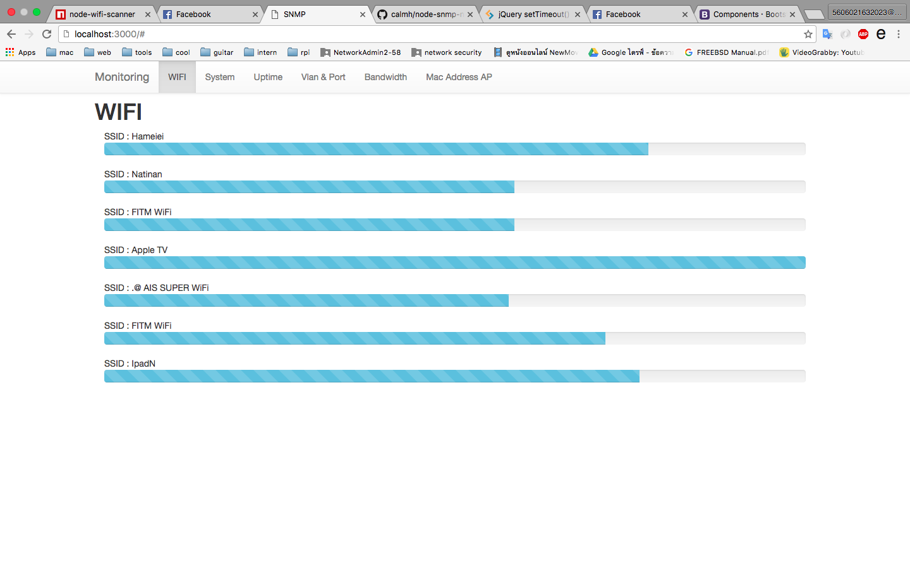

# snmp monitoring network using node.js
### how to install
```
$ git clone https://github.com/bossbossk20/monitor-using-snmp.git
$ cd monitor-using-snmp
$ npm install

```
### how to run
```
$ npm start
```




